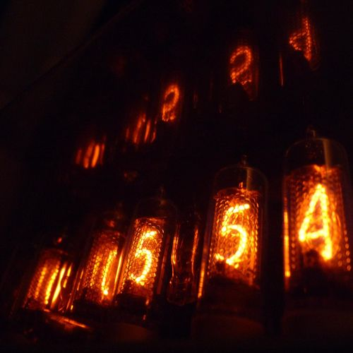
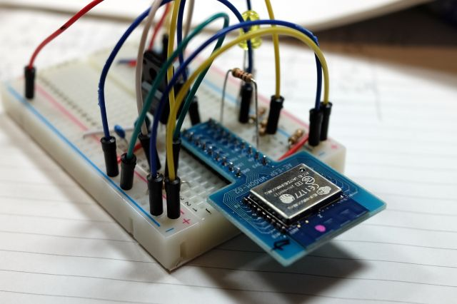
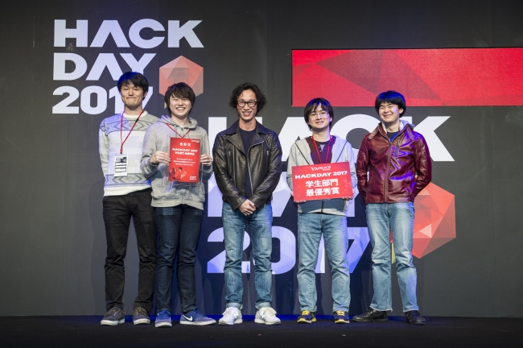
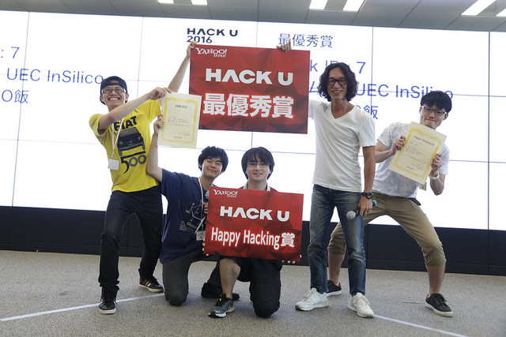

# Shoki Kishdia

## About me

人とモノとの関わり合いがもっと面白いものになればいいなぁと漠然と思っています。

小さなモノでもインターネットに繋がっていて、基板の上に留まらない世界を持っているとか。

人の感覚をもっと活かしたマルチチャンネルなコミュニケーションができるデバイスとか。

色々IT化が進んで便利になってはいますが、デバイスというワンポイントがアクセントになればなーと。

別件ですが、自分の技と才を理解してくれて、正しく自分を指導してくれる師匠のような方を探しています。

## 経歴

* 2015年 私立麻布高等学校 卒業
* 2015年 国立大学法人電気通信大学総合情報学科 入学

## スキル

### 電子工作

  * 株式会社スイッチサイエンスにて、アルバイトとして電子工作関係の業務に携わらせていただいています。(2015/8~)
    * 業務内容
      * ブログ執筆 : [kishida - スイッチサイエンス マガジン](http://mag.switch-science.com/author/kishida/)
      * 利用ドキュメントの作成 例 : [ESP-WROOM-02 Wi-Fi シールドの使い方 - スイッチサイエンスのおまけ](http://trac.switch-science.com/wiki/ESP-WROOM-02_AT)
      * Arduino向けサンプルプログラムの作成 例 : [AQM1248A Simple Library](https://github.com/SWITCHSCIENCE/samplecodes/tree/master/AQM1248A_breakout/Arduino/AQM1248A_lib)
      * 他、基板設計など
  

## 趣味

### 電子工作

  

  自分が思った動作を現実世界に落とし込むことができる楽しさを求めて続けています。中高校時代はロボット等を作る部活で部長を務めました。

### お絵かき

  

  上手い人はいくらでもいますが、自分の頭の中の絵は自分でしか描けないと思っているので、地道にやっています。

### 写真

  

  色や構図などお絵かきでの表現の幅が広がればいいなぁと夢見て最近はじめました。

## 業績

### 2017年
* [ハッカソン] HackDay 2017

  UEC InSilico として参加。ハードウェア担当。IoTハンガー｢TOKICHIRO｣にて｢学生部門最優秀賞｣受賞。

  

  * 画像 : [日本最大級のハッカソン「Yahoo! JAPAN Hack Day 2017」、最優秀賞はレゴブロックで作った迷路がVRでゲーム体験できるチーム名：アルカナラボの「まよいの墓」に決定！](https://prtimes.jp/main/html/rd/p/000000034.000014803.html)

### 2016年
* [ハッカソン] HackU 2016 東京開場

  UEC InSilico として参加。ハードウェア担当。ご飯レコメンドアプリ｢GO飯｣にて｢最優秀賞｣｢HappyHacking賞｣受賞。

  

  * 画像 : [日本最大級の学生向けアプリ・IoT開発イベント「Yahoo! JAPAN Hack U 2016」東京会場予選の最優秀賞は“自動”で行くべき飯屋を決めてくれるアプリ「GO飯」に決定！ ](https://prtimes.jp/main/html/rd/p/000000019.000014803.html)

### 2015年
* [研究(第三著者)] [ドローンによるインタラクティブサーフェス環境の拡張](http://www.wiss.org/WISS2015Proceedings/demo/3-R23.pdf),WISS2015

  赤外線LEDマーカーユニットの製作

## 製作物

### 2017年

* [ハードウェア] Tokichiro の回路設計

### 2016年

* [ハードウェア] GO飯 のモジュール設計(回路、3Dデータ)
* [ハードウェア] GO飯 のモジュール改良版(電源レスで無数の信号パターンを生成可能)
* [ハードウェア] NTP機能付き6桁表示ニキシー管時計 [→リンク](http://hacklog.jp/works/49588)
* [ハードウェア] サーバーからドットマトリクスの表示やサーボモータを制御できるロボット｢Silex｣ [→動画](https://goo.gl/photos/v4ro8TSCPVcXfvjL6)
* [Unity] Unityで産総研のSongleAPIから楽曲データを持ってくるやつ [→リンク](https://github.com/skishida/SongleAPI_Unity)

### 2015年

* [ハードウェア] 大学内で行われたプログラミング教室のハードウェア量産 [→リンク](http://www.uecincu.com/vb/imroom_150719vb.html)
* [ハードウェア] 大学内で行われたプログラミング教室のハードウェア設計･量産 [→リンク](http://www.uecincu.com/vb/imroom_151031vb68.html) [→リンク](http://www.uecincu.com/vb/imroom_151114pro3.html)
* [Unity] MMDMechanimを使わないでGoogle CardboardにMMDモデルを表示して踊らせる方法 [→リンク](http://sparks-row.blogspot.jp/2015/12/mmdunitycardboard_27.html)

### ~2014年

* [ハードウェア]  [Nintendo64のコントローラー型のMIDI音源内蔵楽器](./contents/2014/soundpad.md)
* [ハードウェア]  [コイルガン搭載6足歩行ロボット](./contents/2014/t6.md)
* [ハードウェア]  [6桁表示ニキシー管時計](./contents/2014/nixie.md)

  etc

## 連絡先

* [contact to skishida](https://goo.gl/forms/dEZeub07DOTRuMre2)